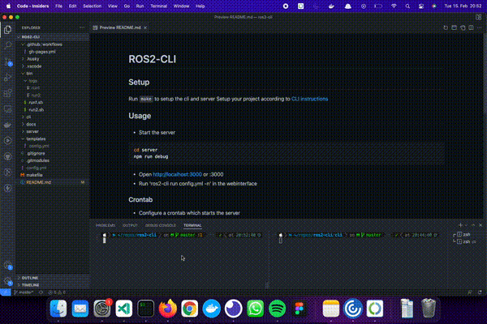

# ROS2-CLI

## Setup

Run `make` to setup the cli and server
Setup your project according to [CLI instructions](./cli/README.md)

## Usage

- Start the server 
```bash
cd server 
npm run debug
```
- Open http://localhost:3000 or <remote-ip>:3000
- Run 'ros2-cli run config.yml -n' in the webinterface

### Crontab

- Configure a crontab which starts the server
- Use it directly after the startup

## Demo



## Improvements

- Add multiple sockets not receiving same data

